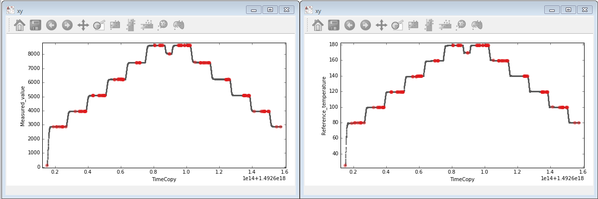
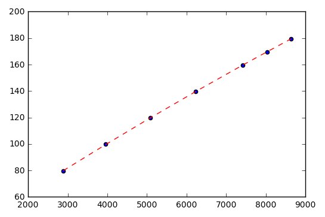

# Temperature calibration
> This notebook is used to evaluate calibration of a temperature sensor.
* Shows how to collect data from different loggers
* How to filter out unnecesary data
* How to synchronize data from different loggers
* How to find satble values
* How to model the relationship between two sensors

## Installation

Not applicable

## Usage example

Check "Temperature_calibration.ipynb" - contains sample data, and the whole process is explained step-by-step

## Development setup

To be added later

## Release History

To be added later

## Meta

Gabor Patassy – patex1987@gmail.com

[https://github.com/patex1987](https://github.com/patex1987)

## Contributing

To be added later
